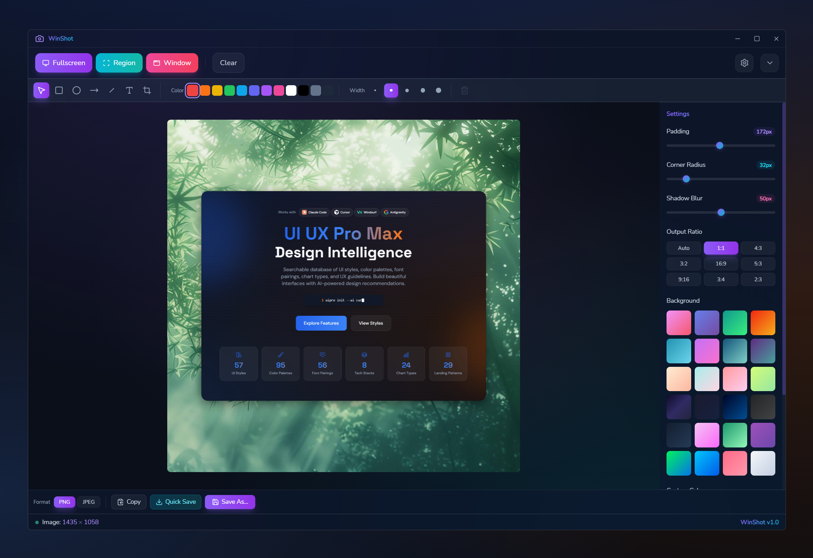

# WinShot - Modern Screenshot Tool for Windows

A lightweight, feature-rich screenshot application built with Wails (Go + React). Capture, annotate, and export screenshots with a beautiful glassmorphism UI.

**90% smaller than Electron** (~10MB) | **Native performance** | **Rich annotation tools**



---

## Features

### Capture Modes
- **Fullscreen** - Capture all displays in one image
- **Region** - Drag to select custom rectangle
- **Window** - Automatically detect and capture active window
- **Hotkey Triggered** - Global shortcuts (Ctrl+PrintScreen, etc.)

### Annotations
- **Shapes** - Rectangle, ellipse (with fill/stroke control)
- **Arrows & Lines** - Directional callouts and custom lines
- **Text** - Add text with customizable font, size, color, alignment
- **Numbers** - Auto-incrementing numbered markers for step-by-step callouts
- **Spotlight** - Highlight areas by dimming surroundings
- **Transforms** - Move, resize, rotate all elements
- **Non-destructive** - Edit or delete annotations anytime

### Editor Features
- **Non-destructive cropping** - Adjust bounds without losing data
- **Aspect ratio presets** - Free, 16:9, 4:3, 1:1, 9:16, 3:4
- **24 gradient backgrounds** - Vibrant glassmorphism presets
- **Real-time preview** - See changes instantly
- **Settings persistence** - Editor preferences saved across sessions

### Export Options
- **Formats** - PNG (lossless) and JPEG (with quality slider)
- **Output ratios** - 9 presets for different platforms
- **Quick Save** - Save to configured folder with auto-naming
- **Background control** - Include or exclude gradient backgrounds

### System Integration
- **System tray** - Icon in taskbar for quick access
- **Global hotkeys** - Customizable keyboard shortcuts
- **Auto-start option** - Launch on Windows startup
- **Minimize to tray** - Keep window out of the way

---

## Installation

### Option 1: Portable Executable (Recommended)

1. Download `winshot.exe` from [GitHub Releases](https://github.com/mrgoonie/winshot/releases)
2. Run directly - no installation required
3. Optionally pin to taskbar or create shortcut

**Requirements:**
- Windows 10 or later
- WebView2 runtime (pre-installed on Windows 11, automatic install on Windows 10)

### Option 2: Installer

1. Download `winshot_installer.exe` from [GitHub Releases](https://github.com/mrgoonie/winshot/releases)
2. Run installer and follow prompts
3. Shortcuts created in Start menu and optional desktop

---

## Quick Start

### Basic Workflow

1. **Launch** WinShot (portable EXE or via Start menu)
2. **Capture** screenshot using one of:
   - Click toolbar buttons (Fullscreen, Region, Window)
   - Press global hotkey (default: Ctrl+PrintScreen for region)
   - Right-click system tray icon
3. **Annotate** (optional):
   - Select annotation tool from toolbar
   - Draw on screenshot
   - Adjust colors and stroke width
4. **Crop** (optional):
   - Switch to crop mode
   - Select desired area and aspect ratio
5. **Export**:
   - Choose PNG or JPEG format
   - Click Export or Quick Save
   - Confirm location (or auto-save to configured folder)

### Keyboard Shortcuts

**Global Hotkeys (Customizable):**
| Shortcut | Action |
|----------|--------|
| `Ctrl+PrintScreen` | Region capture (default) |
| `PrintScreen` | Fullscreen capture |
| `Ctrl+Shift+PrintScreen` | Window capture |

*Customizable in Settings → Hotkeys*

**Editor Shortcuts (App Window):**

| Shortcut | Action |
|----------|--------|
| `V` | Select tool (pointer/move) |
| `R` | Rectangle annotation |
| `E` | Ellipse annotation |
| `A` | Arrow annotation |
| `L` | Line annotation |
| `T` | Text annotation |
| `N` | Number annotation |
| `S` | Spotlight annotation |
| `C` | Crop tool |
| `Ctrl+Z` | Undo annotation |
| `Ctrl+Shift+Z` or `Ctrl+Y` | Redo annotation |
| `Delete` / `Backspace` | Delete selected annotation |
| `Escape` | Deselect / cancel crop mode |
| `Ctrl+O` | Import image file |
| `Ctrl+V` | Paste image from clipboard |
| `Ctrl+S` | Quick save |
| `Ctrl+Shift+S` | Export with format dialog |
| `Ctrl+C` | Copy to clipboard |

---

## Configuration

### Settings Dialog

Access via Settings icon in title bar (⚙️).

**Tabs:**

#### Hotkeys
- **Fullscreen** - Default: PrintScreen
- **Region** - Default: Ctrl+PrintScreen
- **Window** - Default: Ctrl+Shift+PrintScreen
- Custom key combinations supported

#### Startup
- **Launch on startup** - Auto-start WinShot on Windows boot
- **Minimize to tray** - Start minimized instead of maximized
- **Show notifications** - Display toast when screenshot is saved

#### Quick Save
- **Folder** - Default: `%USERPROFILE%\Pictures\WinShot`
- **Filename pattern** - Options: `timestamp`, `date`, `increment`

#### Export
- **Default format** - PNG or JPEG
- **JPEG quality** - 0-100 slider (default: 95)
  - 95+ = visually lossless
  - 75-90 = balanced (recommended)
  - 50-75 = compressed (smaller files)
- **Include background** - Apply gradient to exported image

### Editor Settings

Panel on right side of editor (collapsible):

- **Padding** - Space around screenshot
- **Corner radius** - Rounded corners (0-50px)
- **Shadow size** - Drop shadow depth (0-30px)
- **Background** - Select from 24 gradient presets or custom color

*All settings persist in browser localStorage and survive app restarts.*

---

## Development

### Prerequisites

- **Go** 1.24.0+
- **Node.js** 18+
- **Wails CLI** - Install: `go install github.com/wailsapp/wails/v2/cmd/wails@latest`
- **WebView2 Runtime** - Pre-installed on Windows 11, or manual install on Windows 10

### Setup

```bash
# Clone repository
git clone https://github.com/[owner]/winshot.git
cd winshot

# Install frontend dependencies
cd frontend
npm install
cd ..

# Verify Wails setup
wails doctor
```

### Development Server

```bash
# Run with hot reload
wails dev
```

This starts the app with:
- Frontend: Vite dev server (auto-reload on code changes)
- Backend: Recompile on Go file changes
- Open in Wails dev window

**Frontend only:**
```bash
cd frontend
npm run dev
```

**Backend only:**
```bash
wails build
./winshot.exe
```

### Build

**Portable Executable:**
```bash
wails build
# Output: ./build/bin/winshot.exe (~10-15MB)
```

**Installer (NSIS):**
```bash
wails build -nsis
# Output: ./build/bin/winshot_installer.exe
```

**Release Build (optimized):**
```bash
wails build -upx
# Smaller binary (~7-10MB) using UPX compression
```

### Project Structure

```
.
├── app.go                          # Wails bindings (Go)
├── main.go                         # Entry point
├── wails.json                      # Wails config
├── go.mod / go.sum                 # Go dependencies
├── frontend/
│   ├── src/
│   │   ├── App.tsx                 # Root React component
│   │   ├── components/             # React components (14 total)
│   │   ├── types/                  # TypeScript interfaces
│   │   └── assets/                 # Images, fonts
│   ├── package.json
│   ├── vite.config.ts
│   ├── tailwind.config.js
│   └── tsconfig.json
├── internal/                       # Go packages
│   ├── config/                     # Config persistence
│   ├── hotkeys/                    # Global hotkey registration
│   ├── screenshot/                 # Screen/window capture
│   ├── tray/                       # System tray integration
│   └── windows/                    # Window enumeration
├── docs/                           # Documentation
└── build/                          # Build assets & output
```

---

## Architecture

### Backend (Go)

**Key Packages:**
- `internal/config` - JSON config persistence
- `internal/hotkeys` - Global hotkey registration via Win32 API
- `internal/screenshot` - Multi-display screen capture
- `internal/tray` - System tray icon + context menu
- `internal/windows` - Window enumeration

**Wails Bindings:**
25+ methods exposed to frontend via automatic Go→TypeScript binding.

### Frontend (React)

**Technology Stack:**
- React 18.2 + TypeScript
- react-konva 18.2 for canvas drawing
- Tailwind CSS 3.4 for styling
- Vite 3.0 for build tooling

**Components:**
- `App.tsx` - Central state management
- 14 specialized components for UI, toolbars, dialogs, canvas

**State Management:**
React hooks (useState, useEffect, useCallback) + localStorage for persistence.

### Communication

Frontend ↔ Go via **Wails IPC** (automatic JSON serialization).

Example:
```typescript
// Frontend
const result = await CaptureFullscreen()
// Automatically calls Go method, returns JSON-deserialized CaptureResult
```

See [`docs/system-architecture.md`](./docs/system-architecture.md) for detailed architecture diagrams.

---

## Tech Stack

| Layer | Technology | Purpose |
|-------|-----------|---------|
| **Framework** | Wails v2.10.2 | Desktop app framework |
| **Backend** | Go 1.24.0 | System APIs, screenshot capture |
| **Frontend** | React 18.2.0 | UI framework |
| **Language** | TypeScript 5.3.0 | Type-safe frontend |
| **Canvas** | react-konva 18.2.10 | Shape drawing & editing |
| **Styling** | Tailwind CSS 3.4.0 | Utility-first CSS |
| **Build** | Vite 3.0.7 | Frontend bundler |
| **Screenshot** | kbinani/screenshot | Multi-display capture |

---

## Contributing

Contributions welcome! Please:

1. Fork the repository
2. Create feature branch: `git checkout -b feature/amazing-feature`
3. Commit changes: `git commit -m 'Add amazing feature'`
4. Push to branch: `git push origin feature/amazing-feature`
5. Open Pull Request

**Guidelines:**
- Follow [code standards](./docs/code-standards.md)
- Update tests for new features
- Update documentation as needed
- Keep commits focused and descriptive

---

## Roadmap

### v1.0 (Completed)
- Basic capture modes
- Simple annotations
- PNG export
- Configuration dialog

### v1.2 (Completed)
- Undo/redo ✓
- Keyboard shortcuts ✓
- Clipboard import ✓
- JPEG quality control ✓

### v1.3 (Planned)
- Dark/light theme toggle
- Batch export operations
- Cloud sync for settings

### v2.0 (Future)
- Screen recording
- OCR text extraction
- Cloud sync for settings
- macOS/Linux support

See [`docs/project-overview-pdr.md`](./docs/project-overview-pdr.md) for detailed roadmap.

---

## Troubleshooting

### Common Issues

**Global hotkeys not working**
- Ensure app has focus once (may require privilege elevation)
- Check Settings → Hotkeys for conflicts with other apps
- Try alternative key combinations

**Screenshots appear blurry**
- Confirm DPI scaling in Windows Settings (125%, 150%)
- App handles DPI automatically; if issues persist, file a bug report
- Use JPEG export with lower quality for smaller files

**App crashes on startup**
- Delete `%APPDATA%\WinShot\config.json` to reset configuration
- Check if WebView2 runtime is installed (Windows 10)
- Restart computer and try again

**Export takes too long**
- Large images (4K+) may take 500-800ms
- Reduce output size via aspect ratio control
- Use JPEG format for faster export than PNG

### Debug Mode

Enable debug logging:
```bash
wails dev  # Prints Go errors and exceptions to console
```

---

## License

BSD 3-Clause License

See [LICENSE](./LICENSE) file for details.

---

## Support & Feedback

- **Issues**: [GitHub Issues](https://github.com/[owner]/winshot/issues)
- **Discussions**: [GitHub Discussions](https://github.com/[owner]/winshot/discussions)
- **Reddit**: [/r/winshot](https://reddit.com/r/winshot) (TBD)
- **Discord**: [Invite link](https://discord.gg/...) (TBD)

---

## Acknowledgments

- [Wails](https://wails.io/) - Desktop framework
- [kbinani/screenshot](https://github.com/kbinani/screenshot) - Screen capture
- [react-konva](https://konvajs.org/) - Canvas library
- [Tailwind CSS](https://tailwindcss.com/) - Styling framework

---

## Changelog

### v1.2 (2025-12-24)
- ✨ Clipboard image import via Ctrl+V
- ✨ Configurable JPEG compression quality (0-100 scale)
- ✨ Comprehensive keyboard shortcuts for all tools
- ✨ Tool selection via single-key shortcuts (V, R, E, A, L, T, C)
- ✨ Editor annotations with Undo/Redo shortcuts
- 🚀 Performance improvements for clipboard operations
- 📝 Enhanced documentation with keyboard reference

### v1.1 (2025-12-03)
- ✨ Add arrow and line annotations
- ✨ Add text annotation tool
- ✨ Implement non-destructive cropping
- ✨ Add 24 gradient background presets
- ✨ Support multiple output aspect ratios
- ✨ Copy file path button + auto-copy on quick save
- 🚀 Performance improvements for large images
- 📝 Complete documentation suite

### v1.0 (2025-11-01)
- 🎉 Initial release
- ✅ Fullscreen, region, and window capture
- ✅ Rectangle and ellipse annotations
- ✅ PNG export
- ✅ Configuration dialog
- ✅ System tray integration
- ✅ Global hotkey support

---

**Made with ❤️ for screenshot enthusiasts**
